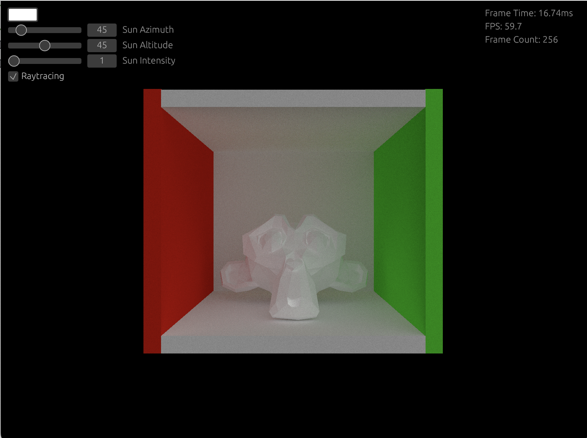

# WPGU-Renderer

A rasterizer and raytracer renderer written in Rust using the
[wgpu](https://github.com/gfx-rs/wgpu) library.



To run:

```zsh
cargo run --release
```

To run wasm:

```zsh
cargo xtask run-wasm --release
```

## Testing

To run integration tests:

```zsh
cargo test --release
```

Install [llvmpipe](https://docs.mesa3d.org/drivers/llvmpipe.html) to run tests with Lavapipe.

```zsh
# Debian/Ubuntu
apt-get install mesa-vulkan-drivers

# Alpine
apk add mesa-vulkan-gallium

# Fedora
dnf install mesa-vulkan-drivers
```

Headless rendering tests compare output against reference images with a 5% tolerance. To regenerate the references after a rendering change:

```zsh
UPDATE_REFERENCES=1 cargo test 
```
