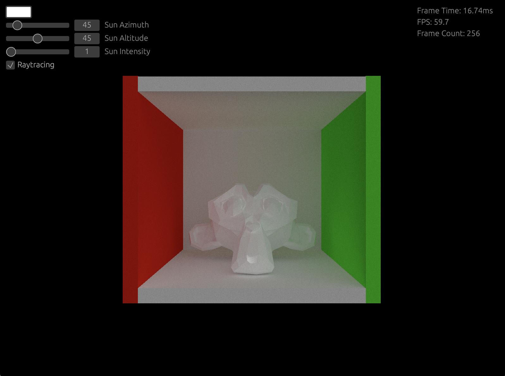

# WPGU-Renderer

A rasterizer and raytracer renderer written in Rust using the
[wgpu](https://github.com/gfx-rs/wgpu) library.



To run:

```zsh
cargo run --release
```

To run wasm:

```zsh
cargo xtask run-wasm --release
```

The raytracer in the web version can only display shades of red because of [this](https://github.com/gpuweb/gpuweb/discussions/4651#discussioncomment-9468086).
